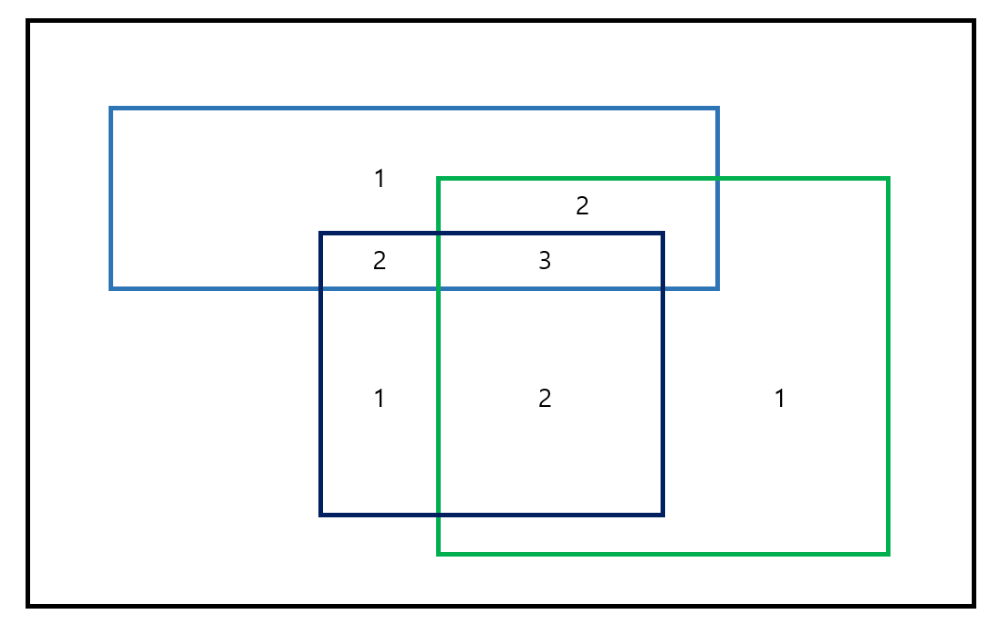

## IMOS 방법

#### 개요
- 정사각형 판자에 직사각형 모양의 얼룩이 묻어있다고 하자.
  

  겹치는 부분이 있을텐데, n번 겹치는 부분의 영역 크기를 알고 싶을 때

  빠르게 구하기 위해서 사용하는 방법!

- 만약 이 방법을 사용하지 않고 평범하게 푼다고 한다면,

  2차원 배열을 순회하면서 차지하는 영역의 값을 1 증가시키는 방식으로 풀 수 있다.

  총 영역의 수가 H개이며, 영역 크기가 NM의 경우, `시간복잡도는 O(NMH)`가 될 것이다.

- 2차원 배열 외에도 수직선 위에 시간 영역을 확인하는 방식에도 사용할 수 있다.

#### 핵심 아이디어
- imos 알고리즘의 기본 아이디어는 **시작과 끝만 확인한다**이다.

  쉽게 수직선 위에서의 적용 과정을 그림으로 표현하면 아래와 같다.

  

  시작부터 끝까지의 모든 구간을 확인하며 1을 더하는 것이 아니다.

  :star:시작 지점에 `+1`, 끝 지점에 `-1`을 입력하는 것!!:star:

  이후 누적합을 구하듯이 시작부터 저장된 숫자를 계산하며 `n 값`을 가지는 부분을 확인한다.

- 이 경우 Q개의 개별 항목을 입력하는데 `O(Q)`만큼이 소요되고, 누적값을 확인하는데 `O(T)`만큼이 걸리므로 총 시간복잡도는 `O(Q + T)`가 된다.

#### 2차원 배열에서의 적용법
- 2차원 배열에서 적용할 때에도 마찬가지로 시작과 끝 점을 이용한다.

  특정 2차원 영역을 `+1`하기 위해선 시작과 끝 점을 총 4개 찾아야 한다.

  

  위 그림과 같이 노란색 영역을 표시하기 위해선 `+1`과 `-1`의 초기 위치를 지정해야 한다.

  단, 본인이 왼쪽 아래를 시점으로 하고 싶다면, `+1`과 `-1`의 지점도 그에 맞게 변경해주면 된다.

  만약 H개의 영역의 4개의 지점을 저 규칙대로 표시하게 된다면, 이후 겹치는 영역을 판단하는 준비는 모두 마무리된 것이 된다.

- 모든 점을 표시한 이후에는 누적합과 같은 방식으로 영역에 숫자를 부여해준다.

  가장 먼저 가로로 진행하며 배열에 누적값을 저장한다.

  `+1`이 있는 곳은 이전 값에 1을 더해주는 방식으로 진행하며, `-1`이 있는 곳은 이전 값에 -1을 빼주는 방식으로 진행한다.

  

  이후에는 같은 방식으로 세로로 진행한다.

  이렇게 되면 결과적으로 노란색 영역에는 1이라는 값이 저장되게 된다.

- 모든 영역의 값을 저장하게 되면 겹치는 횟수가 저장되게 되므로

  목표값과 같은 값을 가지는 영역의 개수를 세주면 원하는 결과를 이끌어낼 수 있게 된다.

  즉, `시간복잡도는 O(NM + Q)`가 된다.

#### 활용 방법
- imos 방법과 같이 시작과 끝 점을 제대로 표시할 수 있다면,

  직각삼각형 영역, 정삼각형 영역 등 다양한 형태의 도형도 표시할 수 있게 된다.

  예를 들어 직각삼각형 영역을 표시한다고 가정하면 점은 총 **6개**를 사용한다.

  

  이렇게 점을 표시한 뒤, 마지막에 2차원 배열에 누적합을 구하는 순서는

  `가로 방향`, `세로 방향`, `대각선 방향`의 순서로 진행하면서 영역에 숫자를 저장한다.

#### 느낀점
- 알고리즘을 학습할 때마다 느끼는 부분이지만, 처음 고안한 사람이 정말 대단하다는 생각이 든다.

  접근 방법과 그 방법을 코드로 작성하는 과정이 혼자서 하기에는 힘들다는 생각이 들고 이런 알고리즘이 나타난 뒤에 공부할 수 있다는게 다행이라는 생각이 든다.

  특히, 직각삼각형을 imos 방식을 이용해 점을 표시하는 것과 이를 이용하는 진행 순서는 정말 신기하다는 생각이 들었다.

#### 관련된 문제
- 파괴되지 않은 건물 - 2022 카카오 블라인드 채용(프로그래머스)

  https://school.programmers.co.kr/learn/courses/30/lessons/92344