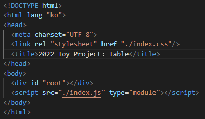

## SSR과 CSR

#### 1. Rendering
- 렌더링 : 서버로부터 HTML 파일을 응답 받아 브라우저에 표시해주는 것을 의미한다.

- SSR과 CSR의 차이는 표시할 화면을 **누가, 어떻게 그리는지**가 결정하게 된다.

#### 2. 웹의 발전 과정
1. 1990년대 중반
  - 1990년 중반까지 대부분의 페이지는 `Statics Sites`의 형식으로 구성되었다.

  - 이는 서버가 완성된 `html` 파일을 보유한 채로 브라우저의 요청에 따라 해당 페이지에 해당하는 html 파일을 서버에서 받아와 화면에 보여주는 방식이다. 

    

  - 이러한 구성 방식에서는 **깜빡임 현상**이 발생하게 된다.

    페이지의 각 링크를 클릭했을 때 해당하는 html 파일을 서버에 요청/응답 받아야 한다.
    
    새로운 html 파일을 이용해 페이지 전체를 업데이트 해야 하기 때문에 잠시 점멸하는 듯한 느낌을 받게 된다.

  - 즉, 링크가 많은 페이지라면 사용성이 점점 떨어지게 된다.

2. 1996년
  - 문서 내에 다른 문서를 담을 수 있는 `<iframe>` 태그가 도입되게 된다.

  - 해당 태그를 이용하여 필요한 페이지를 부분적으로 업데이트 할 수 있게 된다.

3. 1998년
  - `fetch API`의 기원이라 할 수 있는 `XMLHttpRequest API(XHL)`가 개발된다.

    서버와 상호작용할 때 사용하며, XHL을 통해 **페이지의 새로고침 없이** URL에서 데이터를 가지고 올 수 있게 된다.

  - JSON과 같은 데이터 형식으로 필요한 데이터를 서버에서 받아올 수 있게 된다.
    이를 JavaScript를 이용해 **동적으로 html 요소를 생성**하여 페이지에 업데이트한다.

4. 2005년
  - 위 방식이 `AJAX(Asynchronous JavaScript + XML)`라는 공식 명칭을 가지며 사용되게 되며, 이 방식을 사용하는 페이지를 `SPA(Single Page Application)`이라 부르는 것.

  - 하나의 페이지 위에서 사용자가 필요한 데이터를 서버에서 응답 받아 부분적으로 업데이트 하는 방식!

#### 3. CSR(Client Side Rendering)
- :star:클라이언트 사이드 렌더링 : 처음 한 번 페이지 전체를 렌더링한 뒤, 필요한 데이터만 변경하여 사용하는 어플리케이션 방식:star:

  **간단하게 클라이언트가 전부 다 처리한다고 보면 된다.**

- SPA 형식의 페이지 트렌드 + CPU 성능 향상 + JS 표준화(React, Vue Angular 등의 프레임워크가 등장)의 흐름에 따라 CSR이 대중화가 진행된다.

  **SPA + 좋은 CPU + JS 표준화**에 따라 자연스럽게 등장하게 되었다 생각하자

  > SPA(Single Page Application) : 최초 페이지 전체 로딩 후, 데이터만 변경하여 사용

- CSR의 예제는 아래 코드와 같다.

  

  코드를 보면 `<body>`태그 내부에는 `id="root"`만 들어있고, 그 안에 들어갈 자바스크립트의 링크만 포함되어 있는 것을 확인할 수 있다.

- 결국 html 파일 내부에 아무것도 없기 때문에 처음 페이지에 접속한 직후에는 빈 화면만 보이게 된다.

  이후, 클라이언트는 링크된 자바스크립트를 서버로부터 다운로드 받는다. 해당 자바스크립트에는 어플리케이션에 필요한 `로직`, `라이브러리`, `프레임워크`의 소스코드들이 모두 포함되어 있다.

  또한 만약 추가적인 데이터가 필요하게 되었을 때 서버로부터 데이터를 받아와 동적으로 화면을 구성하여 사용자에게 제공한다.

- 이러한 동작 방식에 의해 발생하는 단점이 크게 두 가지가 있다.

  첫 번째, 사용자가 첫 화면을 확인하기까지의 **시간이 오래 걸린다.**

  서버로부터 다운로드 받을 데이터가 적을 경우 큰 문제가 되지 않지만, 요즘 페이지는 그렇지 않다.

  다운로드 받아야 하는 데이터가 많을수록 서버로부터 받아오는데 필요한 시간이 늘어나기 때문에 사용자는 첫 화면을 확인하기까지 오랜 시간을 기다려야 한다.

  
  두 번째, **SEO의 성능이 좋지 않다.**

  여기서 SEO(Search Engine Optimization)란 **검색 엔진 최적화**로 검색 엔진(네이버, 구글 등)에서 찾기 쉽도록 사이트를 개선하는 프로세스이다.

  네이버에 특정 키워드를 입력하면 관련된 사이트를 추천해주는 것을 떠올리면 된다. 이러한 서비스를 위해 검색 엔진은 등록된 웹사이트의 html 문서를 분석한다.

  분석한 내용을 바탕으로 입력한 키워드와 연관된 내용이 있는 페이지를 추천해주게 된다. 하지만 CSR 방식에서 사용되는 html 파일에는 아무것도 없으니 이 기능을 사용하기 힘들게 되는 것!

- 위의 두 가지 문제점을 해결하기 위해 도입된 것이 앞으로 설명할 SSR 방식이다.

#### 4. SSR(Server Side Rendering)