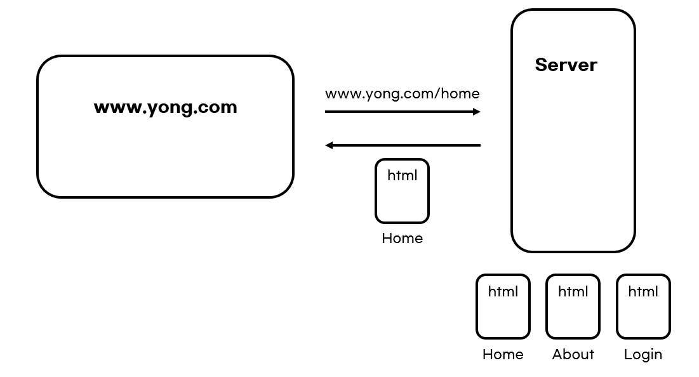

## SSR과 CSR

#### 1. Rendering
- 렌더링 : 서버로부터 HTML 파일을 응답 받아 브라우저에 표시해주는 것을 의미한다.
- SSR과 CSR의 차이는 표시할 화면을 **누가, 어떻게 그리는지**가 결정하게 된다.

#### 2. 웹의 발전 과정
1. 1990년대 중반
  - 1990년 중반까지 대부분의 페이지는 `Statics Sites`의 형식으로 구성되었다.
  - 이는 서버가 완성된 `html` 파일을 보유한 채로 브라우저의 요청에 따라 해당 페이지에 해당하는 html 파일을 서버에서 받아와 화면에 보여주는 방식이다. 
    
  - 이러한 구성 방식에서는 **깜빡임 현상**이 발생하게 된다.
    페이지의 각 링크를 클릭했을 때 해당하는 html 파일을 서버에 요청/응답 받아야 한다.
    새로운 html 파일을 이용해 페이지 전체를 업데이트 해야 하기 때문에 잠시 점멸하는 듯한 느낌을 받게 된다.
  - 즉, 링크가 많은 페이지라면 사용성이 점점 떨어지게 된다.

2. 1996년
  - 문서 내에 다른 문서를 담을 수 있는 `<iframe>` 태그가 도입되게 된다.
  - 해당 태그를 이용하여 필요한 페이지를 부분적으로 업데이트 할 수 있게 된다.

3. 1998년
  - `fetch API`의 기원이라 할 수 있는 `XMLHttpRequest API(XHL)`가 개발된다.
    서버와 상호작용할 때 사용하며, XHL을 통해 **페이지의 새로고침 없이** URL에서 데이터를 가지고 올 수 있게 된다.
  - JSON과 같은 데이터 형식으로 필요한 데이터를 서버에서 받아올 수 있게 된다.
    이를 JavaScript를 이용해 **동적으로 html 요소를 생성**하여 페이지에 업데이트한다.

4. 2005년
  - 위 방식이 `AJAX`라는 공식 명칭을 가지며 사용되게 되며, 이 방식을 사용하는 페이지를 `SPA(Single Page Application)`이라 부르는 것.
  - 하나의 페이지 위에서 사용자가 필요한 데이터를 서버에서 응답 받아 부분적으로 업데이트 하는 방식!
