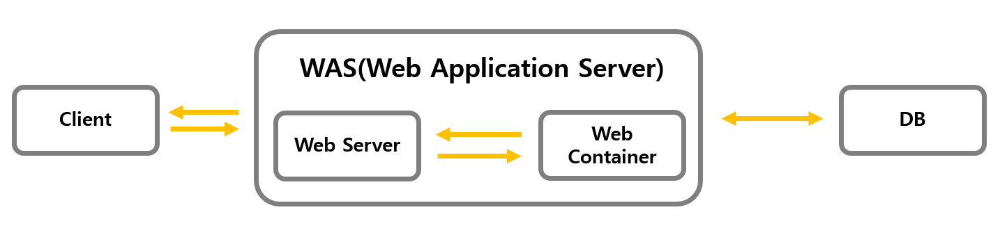

## Web Server와 WAS
#### 정적 페이지와 동적 페이지
- 정적 페이지(Static Pages)
  - 웹 서버에 완성본으로 저장되어 있는 파일을 반환
    Ex) image, html, css, javascript 파일 등
  - 모든 사용자가 동일한 결과물을 받게 된다
  - 서버의 데이터가 변경되지 않는다면, 고정된 웹 페이지 상태를 유지한다
  - 장점
    - 요청에 대한 파일만 전송하면 되므로 속도가 빠르다
    - 단순한 문서로 웹 서버를 구축하게 되므로 호스팅 비용이 적게 들어간다
  - 단점
    - 기존에 저장되어 있는 정보만 보여주기 때문에 한정적인 서비스만 가능하다
    - 변경된 정보를 보여주기 위해선 파일을 직접 수정해야 하기 때문에 관리가 힘들다
- 동적 페이지(Dynamic Pages)
  - 서버에 있는 데이터를 스크립트에 의해 가공된 파일(html)을 반환
  - 사용자는 상황, 시간, 요청 등 다양한 조건에 의해 달라지는 결과물을 받게 된다
  - 장점 : 정적 페이지의 단점에 반대
  - 단점
    - 웹 페이지를 전달하기 전 처리해야 하는 작업이 있으므로 속도가 상대적으로 느리다
    - 웹 서버 이외의 WAS(웹 어플리케이션 서버)가 필요해 추가 비용이 발생한다
    
#### Web Server
- Web Server와 WAS의 간단 관계도
  
- Web Server란?
  - 하드웨어, 소프트웨어 혹은 두 개가 같이 동작하는 것을 의미
  - 하드웨어 측면
    - 웹 서버는 웹 서버의 소프트웨어와 웹사이트의 컴포넌트 파일을 저장하는 컴퓨터
    - 인터넷에 연결되어 웹에 연결된 다른 기기들이 웹 서버의 데이터를 주고받을 수 있도록 함
  - 소프트웨어 측면
    - 웹 사용자가 호스트 파일에 어떻게 접근하는지 관리
    - 웹 브라우저 클라이언트로부터 HTTP 요청을 받아 정적 컨텐츠를 제공하는 프로그램
- Web Server의 기능
  - **HTTP 프로토콜을 기반**으로 클라이언트의 요청을 처리
  - 정적 컨텐츠 요청의 경우
    - 저장되어 있는 정적 페이지 파일을 응답
    - WAS의 도움을 받지 않는다
  - 동적 컨텐츠 요청의 경우
    - WAS에 동적 컨텐츠 제공을 위한 도움을 요청
    - 클라이언트(브라우저)의 요청을 WAS에 보내고 WAS가 처리한 결과를 받아 클라이언트에게 응답
      즉, **브라우저 => 웹 서버 => WAS => 웹 서버 => 브라우저** 순서로 이루어진다
- Web Server가 지켜야 하는 것
  - 항상 실행되어야 한다
  - 항상 인터넷과 연결되어야 한다
  - 항상 같은 IP 주소를 가지고 있어야 한다
  - 제 3자가 유지보수 한다
- Web Server의 예시
  - `Apache Server`, `Nginx` 등

#### WAS(Web Application Server)
- WAS란?
  - DB 조회 혹은 **동적인 컨텐츠**(다양한 로직의 처리가 필요)를 제공하기 위한 애플리케이션 서버
  - HTTP를 통해 컴퓨터나 장치에 애플리케이션을 수행해주는 **미들웨어(소프트웨어 엔진)**
  - **웹 컨테이너** 또는 **서블릿 컨테이너** 라고 불리기도 한다
    - 컨테이너(Container)란?
      `JSP`, `Servlet(서블릿)`을 실행시킬 수 있는 소프트웨어
      WAS는 JSP, Servlet을 구동하는데 필요한 환경을 제공
- WAS가 하는 역할
  - 웹 서버와 웹 컨테이너를 합친 역할을 수행
  - 웹 서버의 기능을 구조적으로 분리, 처리하기 위한 목적으로 개발
    - 분산 트랜잭션, 보안 등의 기능을 처리하는 분산 환경에서 사용
    - DB 서버와 같이 수행
  - 프로그램 실행 환경과 DB 접속 기능 제공
  - 여러 개의 **트랜잭션** 관리 기능
  - 업무 처리를 위한 비즈니스 로직을 수행
- WAS의 예시
  - `Tomcat`, `Jeus` 등

#### Web Server와 WAS를 분리해서 사용하는 이유
WAS로 정적 컨텐츠까지 처리할 수 있는데 왜 Web Server를 별도로 가지는 걸까?
- Web Server가 필요한 이유
  - Web Server가 정적 컨텐츠만 처리하도록 기능을 분배하여 **서버의 부담을 줄이기 위해서**
  - 클라이언트에게 이미지 파일을 전송하는 경우
    - 정적 컨텐츠는 html 문서와 함께 클라이언트로 전송되지 않는다
    - html 문서를 받은 클라이언트가 필요한 정적 컨텐츠를 서버로 요청한 뒤 전송한다
    - 이러한 동작에서 Web Server가 있다면, Application Server를 거치지 않고, 그 전에 응답을 할 수 있다
    - 위와 같은 이유에서 Web Server가 별도로 존재하게 된다
- WAS가 필요한 이유

#### 참고한 사이트
- https://gmlwjd9405.github.io/2018/10/27/webserver-vs-was.html
- https://developer.mozilla.org/ko/docs/Learn/Common_questions/What_is_a_web_server
