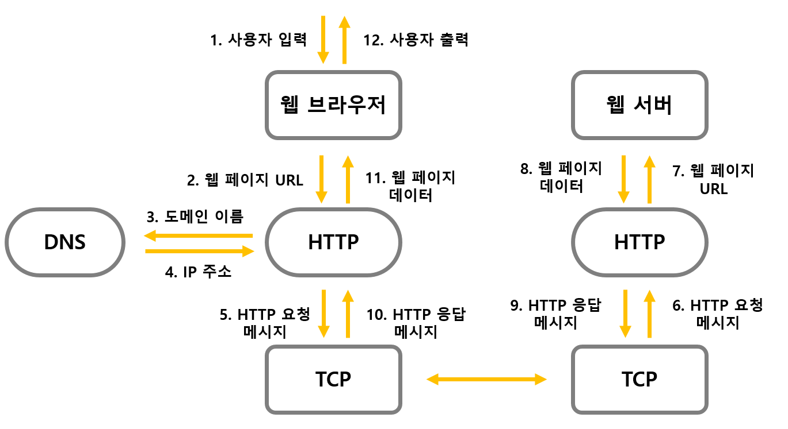

## 웹 동작방식
주소창에 주소를 입력한 뒤 엔터를 입력했을 때 일어나는 과정
#### :star:기본 용어 정리:star:
- DNS : Domain Name System Servers
  - `도메인 이름 시스템 서버`로 URL들의 이름과 IP 주소를 저장하고 있는 DB
  - 웹사이트를 기록한 주소록
  - EX) `www.jinyong.com` => 11.111.111.111 
- TCP/IP : Transmission Control Protocol / Internet Protocol
  - **패킷 통신 방식**의 `전송 제어 프로토콜`과 `인터넷 프로토콜`로 이루어진 것
  - IP(인터넷 프로토콜)은 패킷 전달 여부를 보증하지 않고, 패킷을 보낸 순서와 받는 순서가 다를 수 있다
  - TCP(전송 제어 프로토콜)은 IP 위에서 동작하는 프로토콜로써, 데이터의 전달을 보증하고 보낸 순서대로 받게 해주는 역할을 한다
  - IP 주소를 사용해 데이터를 전달하고 해당 데이터가 정상적으로 전달되었는지에 대한 것
- HTTP : Hypertext Transfer Protocol
  - 클라이언트와 서버가 서로 통신할 수 있게 하기 위한 규약

#### 웹 동작방식
- 간략하게 표현한 구조도
  
1. 사용자가 웹 브라우저 검색창에 주소(`www.naver.com`)를 입력
2. 웹 브라우저에 **캐싱**된 DNS 주소가 있어 해당 도메인 주소(URL)와 대응되는 IP 주소가 있는 경우에는 "5번" 과정으로, 없는 경우 "3번" 과정으로 이동
3. 웹 브라우저가 HTTP를 사용하여 DNS에게 입력된 검색한 도메인 주소(URL)를 요청
4. DNS가 웹 브라우저에게 대응되는 IP 주소를 응답
5. 입력한 도메인 정보(URL)와 응답받은 IP 주소를 HTTP 프로토콜을 통해 HTTP 요청 메세지를 생성하여 요청. 즉, HTML 문서를 요청
6. TCP 프로토콜을 따라 해당 IP 주소의 컴퓨터로 전송
7. HTTP 요청 메세지를 HTTP 프로토콜을 통해 도메인 정보(URL)로 변환
8. 웹 서버는 **WAS**의 도움을 받아 웹 페이지 데이터(HTML 문서)를 응답
9. HTTP 프로토콜을 통해 HTTP 응답 메세지를 생성
10. TCP 프로토콜을 따라 원래 컴퓨터로 전송
11. HTTP 응답 메세지를 HTTP 프로토콜을 통해 웹 페이지 데이터로 변경
12. 웹 브라우저가 화면에 출력

#### WAS(Web Application Server)
- WAS란?
  - DB 조회 혹은 **동적인 컨텐츠**(다양한 로직의 처리가 필요)를 제공하기 위한 애플리케이션 서버
  - HTTP를 통해 컴퓨터나 장치에 애플리케이션을 수행해주는 미들웨어(소프트웨어 엔진)
  - **웹 컨테이너** 또는 **서블릿 컨테이너** 라고 불리기도 한다
    > 컨테이너(Container)란?
    > JSP, Servlet(서블릿)을 실행시킬 수 있는 소프트웨어
    > WAS는 JSP, Servlet을 구동하는데 필요한 환경을 제공
- WAS가 하는 역할
  - 웹 서버와 웹 컨테이너를 합친 역할을 수행
  - 웹 서버의 기능을 구조적으로 분리, 처리하기 위한 목적으로 개발
    - 분산 트랜잭션, 보안 등의 기능을 처리하는 분산 환경에서 사용
    - DB 서버와 같이 수행